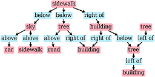
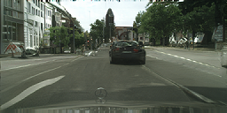

## Unsupervised Traffic Scene Generation with Synthetic 3D Scene Graphs

Demo for the paper:

Artem Savkin, Rachid Ellouze, Nassir Navab, [Federico Tombari]((http://campar.in.tum.de/Main/FedericoTombari)), 
"[Unsupervised Traffic Scene Generation with Synthetic 3D Scene Graphs](https://ieeexplore.ieee.org/document/9636318)", IEEE IROS 2021

[Scene Graphs for Synscapes Dataset](https://syncandshare.lrz.de/getlink/fi24Kh6Mjt5AfhE8wokqUv/)

[Demo](https://artemsavkin.github.io/scenegraph_demo/)
